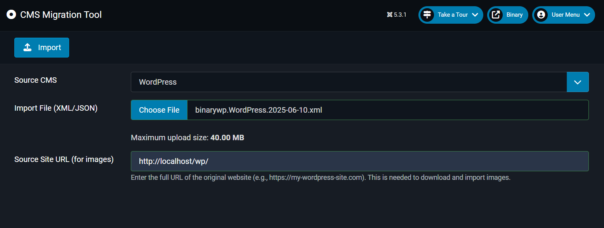
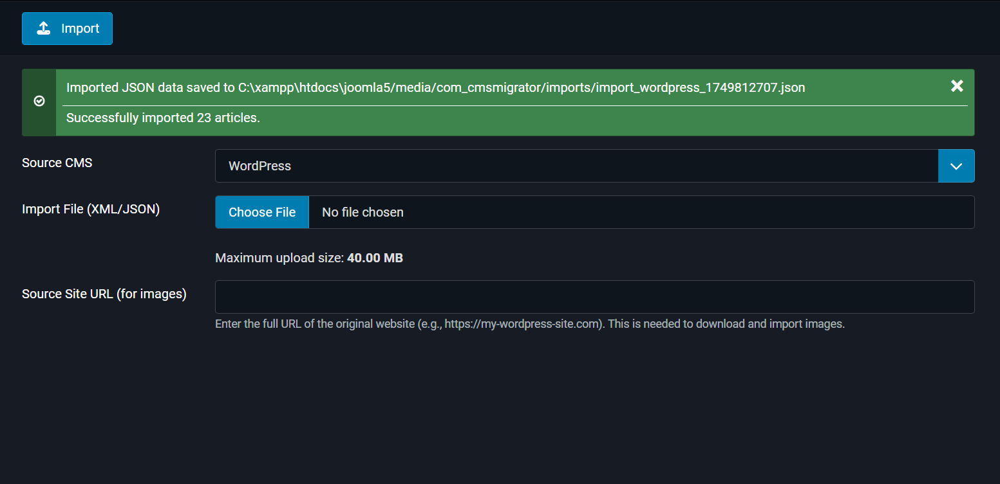

# 🛠 JA Advanced Migration Tool for Joomla

**A powerful Joomla extension for seamless CMS-to-CMS data migration.**

Easily migrate content, users, categories, and more from platforms like **WordPress** into **Joomla**, using a flexible **Component–Plugin event-based system**.

All you need to do is **upload the export file** provided by the source CMS.  
The **dedicated plugin** will automatically:

- Parse the file    
- Generate a structured **JSON payload**

This JSON is then passed to the **JA Advanced Migration** component, which imports the data directly into the **Joomla database**.

---

## 🔌 Plugin-Based Architecture

This tool supports a flexible, extensible plugin system.  
Each migration source (e.g., WordPress) is handled by a dedicated plugin triggered by Joomla events.  

You can easily create custom plugins to support other CMS platforms or proprietary data formats.

---

## 📦 WordPress Migration Plugin (Submodule)

> **Plugin Name:** `plg_migration_wordpress`  
> **Purpose:** Adds support for migrating content from WordPress via WXR/XML export files.

### 🔧 Plugin Features

- ✅ Supports WordPress `post` and `page` types  
- 🗂 Extracts categories, tags, and authors  
- 🖼 Automatically rewrites embedded image URLs using WordPress media links  
- 📅 Converts `pubDate` to ISO 8601 format  

---

## ⚙️ How It Works

1. Export your WordPress content using **Tools → Export → All Content**
2. Upload the `.xml` file through the **Migration Tool** interface

3. The `plg_migration_wordpress` plugin is triggered via the `onMigrationConvert` event
4. It reads and parses the WXR file and returns a structured JSON payload
5. The JSON can be reviewed, stored, or used to generate Joomla content
6. The JSON is then imported into the Joomla database

---
