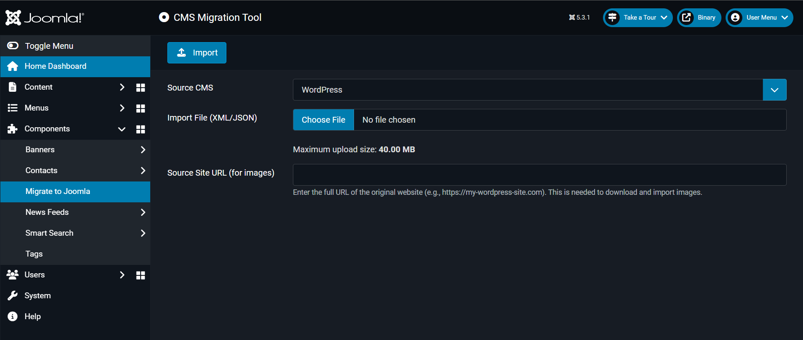

# Advanced Migration Tool - Project Brief

## What is this project?

The **Advanced Migration Tool** is a Joomla extension that helps website owners migrate their content from other content management systems (like WordPress) into Joomla. 

*The main migration interface showing configuration options*

## Why was this built?

Many people want to switch their websites to Joomla but find it difficult to move their existing content (articles, images, users, categories) from their current platform. This tool automates that process, making it much easier and faster than doing it manually.

### Problems it solves:
- **Manual migration is tedious**: Copying articles, categories, and media files one by one takes forever
- **Content format differences**: Different platforms store content differently
- **Media file headaches**: Images and files need to be downloaded and reorganized
- **User and permission mapping**: Preserving authors and access levels during migration
- **Error handling**: Things go wrong during migration, and you need to know what happened

## What can it do?

### Core Features:
- **Import from WordPress**: Upload WordPress export files (WXR/XML format) and convert them to Joomla
- **Import from JSON**: Support for generic JSON-formatted content exports
- **Smart media migration**: Automatically download images and files from your old site via FTP/SFTP or ZIP upload
- **User migration**: Preserve article authors and user accounts
- **Category mapping**: Keep your content organization intact
- **Progress tracking**: See real-time status during long migrations
- **Error logging**: Detailed logs when something goes wrong
- **Transaction safety**: If migration fails, your Joomla site stays clean

### Media Migration Options:
- **FTP/FTPS/SFTP**: Connect directly to your old server to download media files
- **ZIP Upload**: Upload a ZIP file containing all your media files
- **Flexible storage**: Choose where to store migrated files in your Joomla media folder

## How does it work?

The tool follows a simple 3-step process:

1. **Upload**: You upload an export file from your old CMS (like a WordPress XML export)
2. **Configure**: Set up media migration options if you want to transfer images and files
3. **Import**: The tool processes everything automatically and shows you the progress

Behind the scenes, it:
- Parses your export file to understand the content structure
- Converts content to Joomla's format
- Downloads and organizes media files
- Creates articles, categories, and users in your Joomla database
- Maps relationships between content elements

## Technical Overview

### Built With:
- **PHP 8.1+**: Core programming language
- **Joomla 5+ Framework**: Built as native Joomla component and plugins
- **phpseclib**: For secure FTP/SFTP connections

### Architecture:
- **Component-Plugin Structure**: Main component handles the interface, plugins handle specific CMS formats
- **Event-Driven Design**: Uses Joomla's event system for extensibility
- **MVC Pattern**: Clean separation of data, logic, and presentation
- **Modular Design**: Easy to add support for new platforms

### Current Platform Support:
- ✅ **WordPress** (via WXR/XML export files)
- ✅ **Generic JSON** (for custom export formats)
- 🔄 **Extensible** (developers can add plugins for other platforms)

> **For detailed architecture and development information, see [Developer Documentation](./Developer_Documentation.md).**

## Installation & Requirements

### System Requirements:
- Joomla 4.0 or higher
- PHP 7.4 or higher
- MySQL/MariaDB database
- ZIP extension enabled

### Installation:
1. [Download](https://github.com/joomla-projects/JA-Advanced-Migration-Tool/releases) the extension package
2. Install via Joomla Extension Manager
3. Enable the component and plugins
4. Access via "Components > Migrate to Joomla" in Joomla admin

> **Detailed installation steps are available in [User Documentation](./User_Documentation.md).**

## Project Status

- **Version**: 0.1.1
- **Status**: Beta/Development
- **License**: GPL 2.0+
- **Organization**: Joomla Academy

### Current Capabilities:
- WordPress to Joomla migration is fully functional
- Media migration via FTP/SFTP/ZIP works
- Progress tracking and error handling implemented
- JSON import support available

> **For testing information, refer to [Testing Documentation](./Testing_Documentation.md).**

## Developer Information

The project is part of the **Joomla Academy** initiative and welcomes contributions from the community.

## Documentation

This project includes comprehensive documentation:

- **[User Documentation](./User_Documentation.md)**: Step-by-step migration instructions
- **[Developer Guide](./Developer_Documentation)**: Architecture overview and extension development
- **[Testing](./Testing_Documentation.md)**: How to run tests and contribute

## Support & Community

- **GitHub Repository**: [Joomla Academy Project](https://github.com/joomla-projects/JA-Advanced-Migration-Tool)
- **Mattermost Channel**: Community discussions and support
- **Issue Tracker**: Bug reports and feature requests

---

*This tool is designed to make CMS migration accessible to everyone, from individual bloggers to large organizations. Whether you're a site owner looking to migrate or a developer wanting to extend the platform support, this tool provides a solid foundation for content migration to Joomla.*