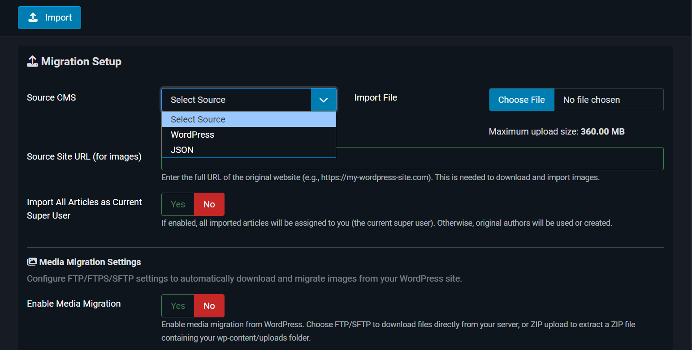
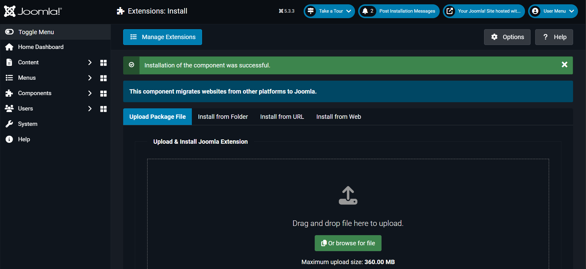
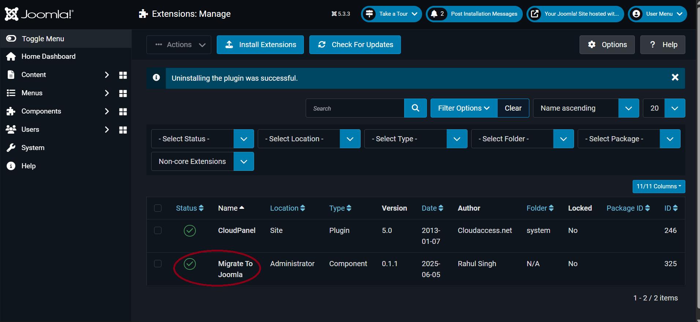
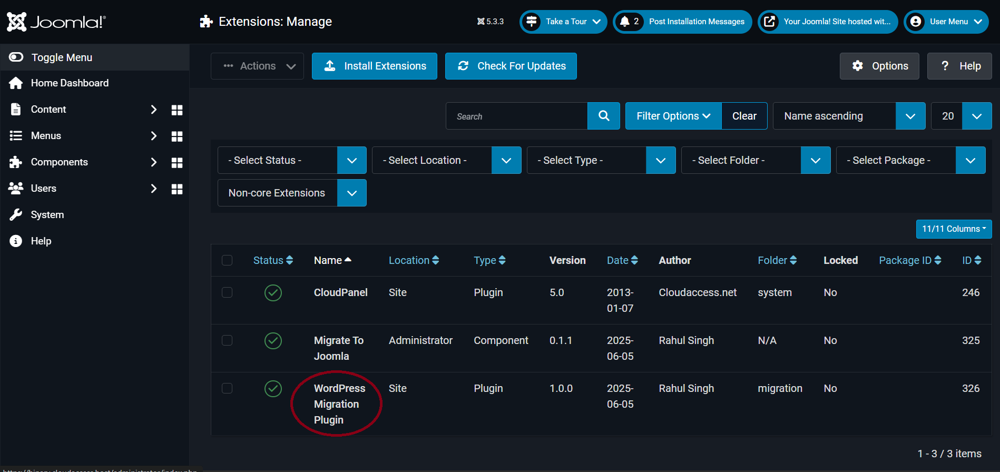
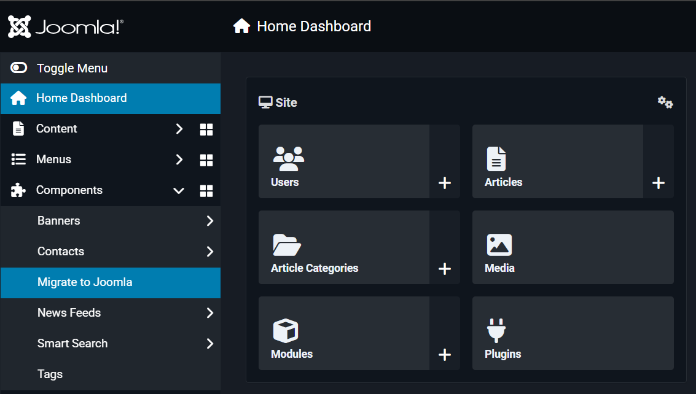
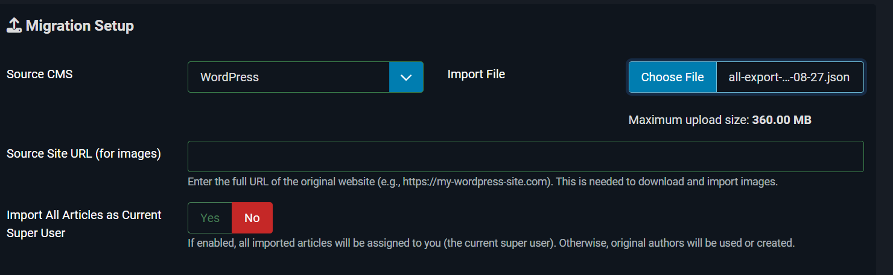
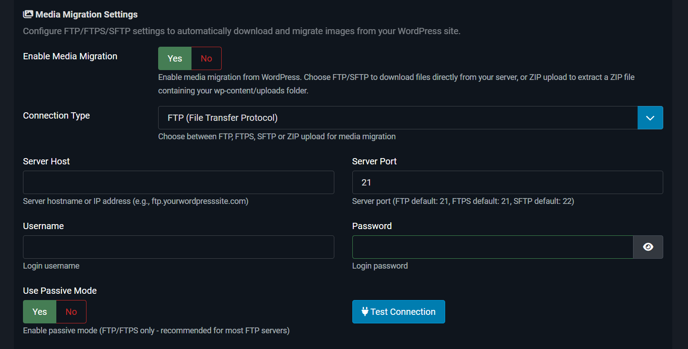
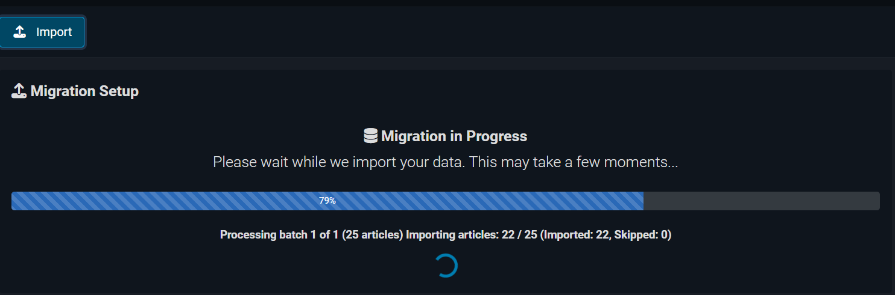
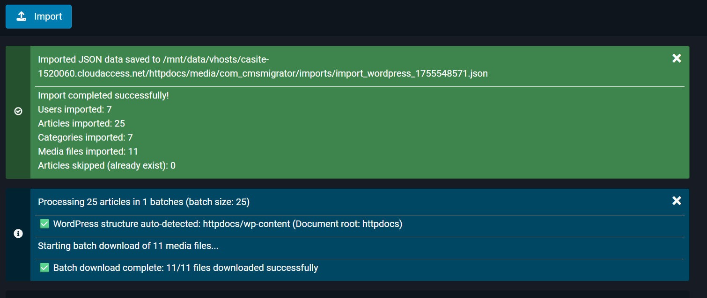
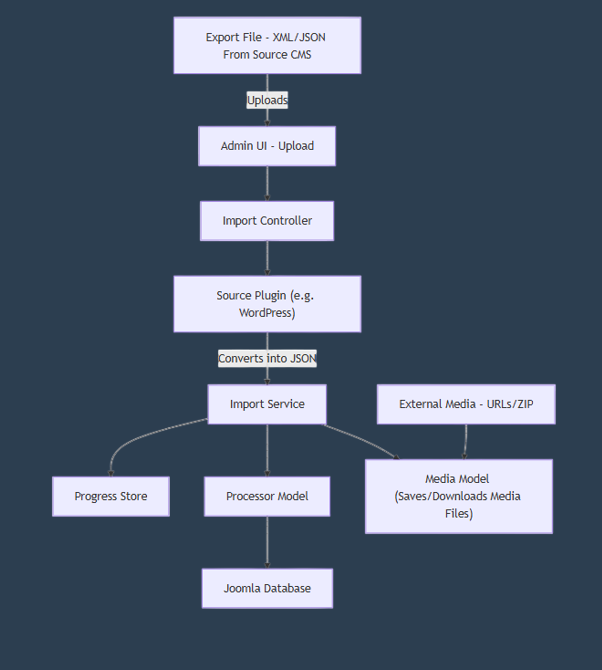

# Joomla Migration Tool – User Documentation

**Complete guide for migrating content from other CMS platforms to Joomla using the Advanced Migration Tool.**


*The JA Advanced Migration Tool interface - Simple, powerful, reliable*

---

## 📋 Table of Contents

- [Introduction / Overview](#-introduction--overview)
- [Supported Source Platforms](#-supported-source-platforms)
- [System Requirements (Joomla 5+)](#-system-requirements-joomla-5)
- [Installation & Setup](#-installation--setup)
- [Migration Workflow](#-migration-workflow)
- [Component Plugin Architecture](#-component-plugin-architecture)
- [Troubleshooting](#%EF%B8%8F-troubleshooting)
- [FAQs](#-faqs)


---

## 🎯 Introduction / Overview

The **Advanced Migration Tool** is a powerful Joomla extension that enables seamless content migration from various CMS platforms to Joomla. It provides **two flexible migration methods** to accommodate different scenarios and technical requirements.

### ✨ Key Features
- **Dual Migration Paths**: Native export files OR standardized JSON format
- **Complete Content Migration**: Articles, Categories, Tags, Users, Menus Custom Fields, and Media
- **Smart Media Transfer**: FTP/FTPS/SFTP/ZIP with automatic URL rewriting
- **Safe Operations**: Duplicate detection, real-time progress tracking, and comprehensive logging
- **Batch Processing**: Optimized for migrating large sites.
- **User-Friendly Interface**: Intuitive workflow with clear progress indicators

### 🔄 Two Migration Methods

 

| **Method 1: Native Export Files** | **Method 2: JSON Export** |
|-----------------------------------|---------------------------|
| Uses your CMS's standard export format | Uses our standardized JSON format |
| Requires CMS-specific Joomla plugins | Requires export plugin on source CMS |
| **Best for**: Standard migrations, official exports | **Best for**: Enhanced control, custom requirements |

---

## 🌐 Supported Source Platforms

### Currently Supported

| Platform | Method 1 (Native) | Method 2 (JSON) | Status |
|----------|-------------------|-----------------|---------|
| **WordPress** | ✅ WXR/XML Export | ✅ JSON Export | Fully Supported |


### Platform-Specific Details

#### WordPress
- **Native Export**: Uses WordPress WXR (WordPress eXtended RSS) format
- **JSON Export**: Enhanced export with our WordPress plugin
- **Content Types**: Posts, Pages, Categories, Tags, Users, Menus, Media, Custom Fields

#### Universal JSON Format
- **Compatibility**: Works with any CMS using our export plugins
- **Standardized Schema**: JSON-LD format for consistent data structure
  
- **Extensibility**: Easy to extend for new platforms

---
## 💻 System Requirements (Joomla 5+)

* **Joomla:** 5.x ✅ | **5.3+ ⭐ Recommended**
* **PHP:** 8.1+ 
* **Memory Limit:** 128MB (256MB+ Recommended)
* **Execution Time:** 120s (300s Recommended)
* **Upload Size:** 32MB (100MB+ Recommended)
* **Disk Space:** 500MB+ free

#### Required PHP Extensions
- `zip` - For media archive handling
- `ftp` - For FTP media migration
- `ssh2` - For SFTP media migration (optional)
- `curl` - For remote file operations
- `mbstring` - For character encoding

#### File Permissions
```
📁 media/com_cmsmigrator/     → 755 (Write access for logs)
📁 images/                    → 755 (Write access for media)
📁 tmp/                       → 755 (Write access for uploads)
```
---

## 🚀 Installation & Setup

### Step 1: Install the Migration Component

1. **[Download](https://github.com/joomla-projects/JA-Advanced-Migration-Tool/releases)** the component package (`com_cmsmigrator.zip`)
2. **Login** to Joomla Administrator
3. **Navigate** to **System → Install → Extensions**
4. **Upload** the component package



5. **Verify** installation success


*Component installation process*

### Step 2: Install Migration Plugins

#### For Method 1 (Native Export Files)

Install the appropriate plugin for your source CMS:

| Source CMS | Plugin Package | Installation Required |
|------------|----------------|-----------------------|
| **WordPress** | `plg_migration_wordpress.zip` | ✅ Required for WXR files |

**Installation Steps:**
1. **Upload** the plugin package via **System → Install → Extensions**
2. **Verify** successful installation message
3. **Proceed** to Step 3 to enable the plugin


*Plugin installation*

#### For Method 2 (JSON Export)

**No additional Joomla plugins required!** The component includes built-in JSON processing.

Instead, install our export plugin on your **source CMS**:

| Source CMS | Export Plugin | Installation Location |
|------------|---------------|----------------------|
| **WordPress** | `all-export-wp.zip` | WordPress Admin → Plugins |

### Installation Verification

1. **Navigate** to **Components → Migrate to Joomla**
2. **Check** that your source CMS appears in the dropdown
3. **Verify** file upload functionality works
4. **Test** connection features (if using media migration)


*Successful installation of Component*

---

## 🔄 Migration Workflow

### 1. Choose Source CMS

#### Method 1: Native Export Files
1. **Access** the migration tool: **Components → CMS Migrator**
2. **Select** your source CMS from the dropdown (e.g., "WordPress")
3. **Ensure** the corresponding plugin is installed and enabled

 
*Source CMS selection interface*

#### Method 2: JSON Export
1. **Select** "JSON" from the source CMS dropdown
2. **No additional plugins** required in Joomla
3. **Prepare** your JSON export file from the source CMS

### 2. Connect to Source

#### Upload Export File
1. **Click** "Choose File" or drag and drop your export file
2. **Supported formats**:
   - WordPress: `.xml` (WXR format) or `.json`
   - JSON: `.json` files from our export plugins


*File upload interface*

#### Configure Source URL (Optional but Recommended)
- **Purpose**: Enables proper media URL rewriting
- **Format**: `https://yoursourcesite.com` (no trailing slash)
- **Example**: `https://mywordpress.com`

#### Media Migration Setup (Optional)
Choose your media transfer method:

| Method | Use Case | Configuration |
|--------|----------|---------------|
| **FTP/FTPS** | Live sites with FTP access | Host, Port, Username, Password |
| **SFTP** | Secure server environments | Host, SSH Port, Username, Password |
| **ZIP Upload** | Offline or restricted access | Upload media archive |
| **Skip Media** | Content-only migration | No additional setup |


*Media migration configuration options*

### 3. Select Content Types

#### Import Options
- **Import as Super User**: Assign all content to current administrator
- **Preserve Authors**: Maintain original authorship (creates user accounts)

### 4. Run Migration

#### Migration Execution
1. **Click** "Start Import"
2. **Monitor** real-time progress
3. **View** detailed operation logs
4. **Wait** for completion confirmation


*Real-time migration progress with detailed logging*

#### Completion Report
After migration, you'll receive a detailed report:

```
📊 Migration Summary
✅ Articles: 150 imported, 5 skipped (duplicates)
✅ Categories: 12 imported
✅ Tags: 45 imported
✅ Users: 8 imported
✅ Media Files: 230 transferred
⚠️ Warnings: 3 (see logs for details)
```


*Detailed migration completion report*

---

## 🔌 Component Plugin Architecture

### Migration Plugin System

The tool uses Joomla's event-driven plugin architecture for maximum flexibility and extensibility.

### Plugin Types

#### 1. Migration Plugins (Method 1)
These plugins handle specific CMS export formats:

```
plugins/migration/
├── wordpress/          # WordPress WXR handler
```

**Functionality:**
- Parse source CMS export files
- Convert to standardized internal format
- Handle platform-specific quirks

#### 2. Export Plugins (Method 2)
These are installed on your **source CMS** to generate JSON exports:

```
Source CMS Plugins:
├── WordPress: all-export-wp/
```

**Functionality:**
- Access source CMS database directly
- Generate standardized JSON-LD format
- Include all content types and metadata

### Event System Flow
<p align="center">
  
  <br>
  <em>Plugin system architecture diagram</em>
</p>


#### Joomla Preparation
1. **Fresh installation recommended** for major migrations
2. **Configure categories structure** before migration

### Migration Optimization

#### For Large Sites (1000+ articles)
1. **Increase PHP limits**:
   ```php
   memory_limit = 512M
   max_execution_time = 600
   upload_max_filesize = 200M
   ```

2. **Migration in batches**:
   - Split large exports into smaller files
   - Migrate content types separately
   - Use multiple sessions for media

3. **Server optimization**:
   - Temporary disable caching
   - Increase database timeouts
   - Monitor disk space

#### Media Migration Best Practices
1. **Test connection first**: Always verify FTP/SFTP before starting
2. **Use ZIP method** for large media libraries (>500MB)
3. **Organize destination folders**: Use dated folders for organization
4. **Monitor transfer progress**: Large transfers can take hours

---

## 🛠️ Troubleshooting

### Common Issues & Fixes

#### Upload and File Issues

| Issue | Symptoms | Solution |
|-------|----------|----------|
| **File upload fails** | Error on file selection | Increase `upload_max_filesize` and `post_max_size` |
| **Timeout during upload** | Page loads indefinitely | Increase `max_execution_time` |
| **Invalid file format** | "Unsupported file" error | Verify export file format and plugin installation |
| **Corrupted export file** | Parse errors during import | Re-export from source CMS, check file integrity |


#### Connection and Permission Issues

| Issue | Symptoms | Solution |
|-------|----------|----------|
| **FTP connection failed** | "Connection timeout" | Verify host, port (21), credentials, firewall settings |
| **SFTP authentication error** | "Auth failed" | Check SSH credentials, key authentication, port 22 |
| **Permission denied** | "Cannot write to directory" | Set 755 permissions on media directories |
| **Database connection lost** | "MySQL server has gone away" | Increase database timeout settings |

#### Migration Process Issues

| Issue | Symptoms | Solution |
|-------|----------|----------|
| **Migration stops mid-process** | Progress bar freezes | Check PHP memory limit, error logs |
| **Partial content import** | Some articles missing | Verify source file completeness, re-run migration |
| **Broken media links** | Images don't display | Check source URL configuration, media migration settings |
| **Duplicate content errors** | "Already exists" warnings | Normal behavior - existing content is skipped |

#### Plugin-Specific Issues

**WordPress Plugin Issues:**
```
Issue: "WordPress plugin not recognized"
Solution: 
1. Verify plugin is installed and enabled
2. Check plugin group is "migration"
3. Clear Joomla cache
4. Re-install plugin if necessary
```

**JSON Import Issues:**
```
Issue: "Invalid JSON format"
Solution:
1. Validate JSON syntax online
2. Check file encoding (UTF-8)
3. Verify JSON-LD schema compliance
4. Re-export with updated plugin
```

## ❓ FAQs

### General Questions

**Q: Can I run multiple migrations on the same Joomla site?**\
A: Yes, the tool safely handles multiple migrations. Duplicate content (same titles) is automatically skipped.

**Q: What happens to existing Joomla content?**\
A: Existing content is preserved. The migration tool only adds new content and skips duplicates.

**Q: How long does a typical migration take?**\
A: Depends on content size:
- Small sites (< 100 articles): 1-5 minutes
- Medium sites (100-1000 articles): 5-30 minutes  
- Large sites (1000+ articles): 30-180 minutes

**Q: Can I migrate from multiple source sites?**\
A: Yes, you can run separate migrations for each source site. Content is merged safely.

### Technical Questions

**Q: Which migration method should I choose?**\
A:
- **Method 1 (Native)**: Best for standard WordPress exports, no source CMS changes required
- **Method 2 (JSON)**: Best for custom requirements, enhanced control, consistent format

**Q: Are user passwords migrated?**\
A: No, for security reasons. All migrated users receive random passwords and must reset them.

**Q: How are custom fields handled?**\
A: Custom fields are automatically mapped to Joomla custom fields. Underscore-prefixed fields are treated as metadata.

**Q: Can I customize the migration process?**\
A: Yes, through plugin configuration and custom export plugins. See Developer Documentation for details.

### Content-Specific Questions

**Q: What content types are supported?**\
A: Standard support includes:
- ✅ Articles/Posts/Pages
- ✅ Categories (with hierarchy)
- ✅ Tags
- ✅ Menus
- ✅ Users
- ✅ Custom Fields
- ✅ Media files

**Q: How are WordPress shortcodes handled?**\
A: Basic shortcodes are converted to Joomla equivalents. Complex shortcodes may require manual review.

### Media Migration Questions

**Q: Where are migrated media files stored?**\
A: Default location is `images/imports/` but you can specify a custom directory.

**Q: What if media files are very large?**\
A: Use the ZIP upload method for large media libraries, or configure FTP with increased timeouts.

**Q: Are media file names preserved?**\
A: Yes, including directory structure. File conflicts are handled with numerical suffixes.

---